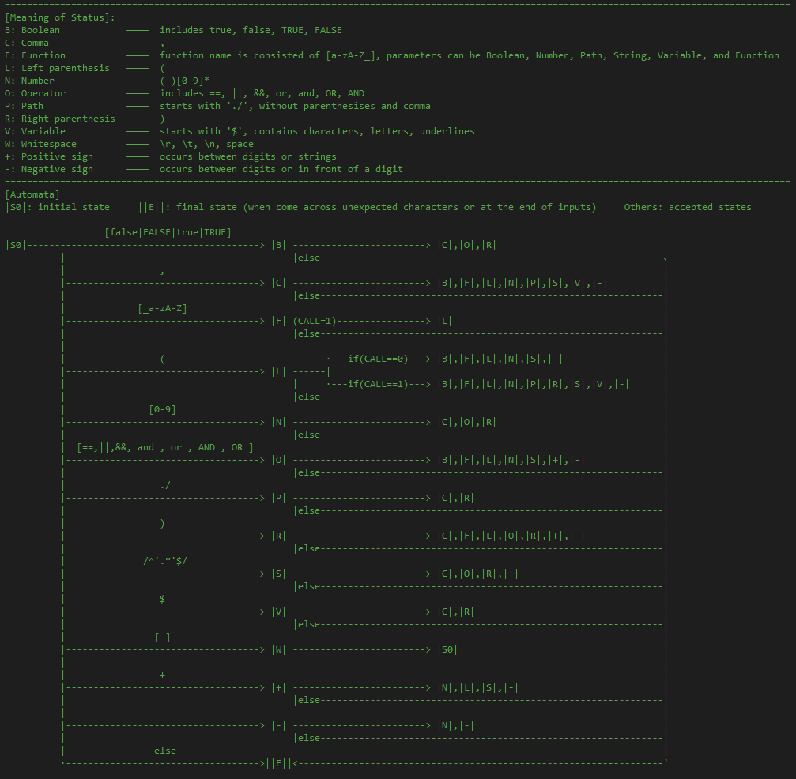
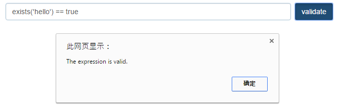
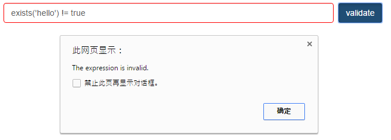

# ExpressionParser
## *A javascript expression parser, which is realized by an automata, used for validating whether the inputs string is a valid expression.*

##[automata]

##[valid expression]

##[invalid expression]

